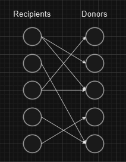
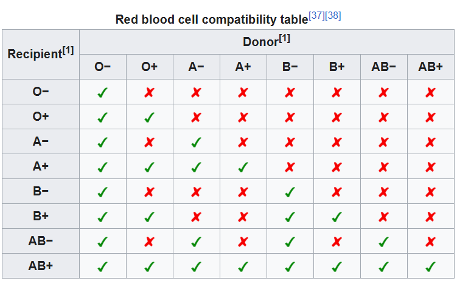

# Donation

Matching compatible donor-recipient pairs in a blood exchange program. Some vertices represent donors and others represent recipients. Matching requires donor and recipient compatibility, and each donor can only be a donor to one recipient.

Each vertex of the graph represents a person. Each edge represents a possible donation. The goal
is to find the maximum match between donors and recipients.

## The compatibility is determined by the following conditions on blood group:

